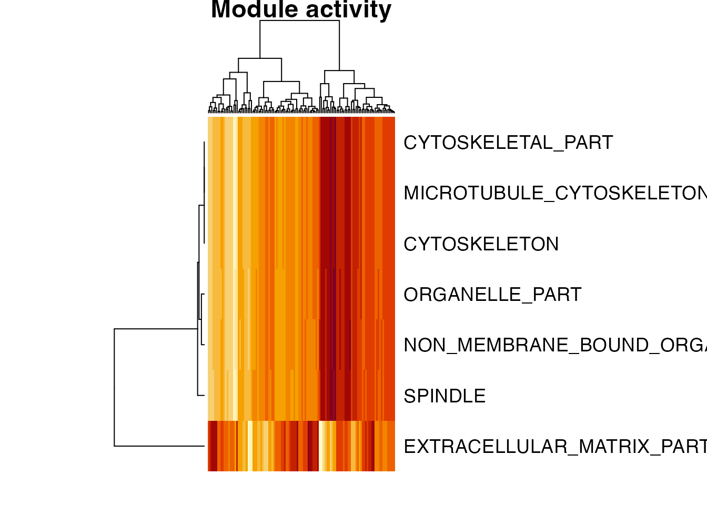

# Getting started with eemr

## Background

**eemr** is an R/Rcpp binding for the original *eemCpp* command-line
tool. It implements coherence-based expression module (EEM) search:
given an expression matrix and a collection of candidate gene sets
(e.g. from MSigDB), it finds, for each gene set, the largest subset of
genes whose expression is coherent across samples (an “expression
module”), and assigns that module a significance p-value based on a
randomization test. It’s conceptually similar to gene set enrichment
analysis, but the “signal” being tested is coherence of expression
rather than differential expression, and only the coherent subset of
each gene set is retained.

The whole pipeline runs in memory from R – no intermediate files, no
external CLI binary.

``` r

library(eemr)
```

## Input data

[`eem_search()`](https://atusiniida.github.io/eemr/reference/eem_search.md)
takes two inputs, already loaded into R: `expr`, a numeric matrix, and
`geneSets`, a named list of character vectors. Both are commonly
distributed as plain-text files, so this package bundles a small real
example of each and provides
[`read_gmt()`](https://atusiniida.github.io/eemr/reference/read_gmt.md)
to read the gene set file.

### Expression matrix (`.tab`)

A tab-delimited text file: the first line is a header giving the sample
names (with an empty first field), and each following line is one gene –
its name, then one tab-separated numeric value per sample:

        sample1 sample2 sample3
    GENE1   4.68    5.37    13.16
    GENE2   4.72    10.36   12.11

This is exactly the format read by
`read.table(file, header = TRUE, row.names = 1, sep = "\t", check.names = FALSE)`,
which is how the bundled `test.tab` is loaded below.
`check.names = FALSE` keeps sample names that aren’t valid R identifiers
(e.g. starting with a digit) unchanged. The result is coerced to a plain
numeric `matrix` with
[`as.matrix()`](https://rdrr.io/r/base/matrix.html) because
[`eem_search()`](https://atusiniida.github.io/eemr/reference/eem_search.md)
requires a matrix, not a data.frame.

### Gene sets (`.gmt`)

A tab-delimited GMT file, the format used by MSigDB/GSEA: one gene set
per line, with the gene set id, a description (unused here, but required
by the format – `"na"` if you don’t have one), and then one gene id per
remaining field:

    GENE_SET_1  na  GENE1   GENE2   GENE3
    GENE_SET_2  na  GENE4   GENE5   GENE6   GENE7

`read_gmt(file)` reads this into a named list, e.g.
`list(GENE_SET_1 = c("GENE1", "GENE2", "GENE3"), ...)`, suitable for
[`eem_search()`](https://atusiniida.github.io/eemr/reference/eem_search.md)’s
`geneSets` argument.

This package bundles a small real dataset (1000 genes x 118 breast
cancer samples, and 100 candidate GMT gene sets) for examples and
testing:

``` r

expr_file <- system.file("extdata", "test.tab", package = "eemr")
gmt_file  <- system.file("extdata", "test.gmt", package = "eemr")

expr <- as.matrix(read.table(expr_file, header = TRUE, row.names = 1,
                              sep = "\t", check.names = FALSE))
geneSets <- read_gmt(gmt_file)

dim(expr)
#> [1] 1000  118
length(geneSets)
#> [1] 100
```

## Running the search

``` r

res <- eem_search(expr, geneSets)
```

The result is a data.frame with one row per gene set that passed the
search, sorted by decreasing `pvalue` (more significant first):

``` r

head(res[, c("id", "pvalue", "pvalue1", "pvalue2",
             "nSeedGenes", "nModuleGenes")], 10)
#>                                    id    pvalue   pvalue1   pvalue2 nSeedGenes
#> 1                             SPINDLE 14.809837 13.408965 14.809837         10
#> 2            MICROTUBULE_CYTOSKELETON 11.518622 10.411940 11.518622         18
#> 3                   CYTOSKELETAL_PART  9.007283  8.155555  9.007283         26
#> 4                        CYTOSKELETON  7.872272  6.716510  7.872272         34
#> 5        NON_MEMBRANE_BOUND_ORGANELLE  7.646947  6.903397  7.646947         40
#> 6                      ORGANELLE_PART  6.781448  5.921035  6.781448         57
#> 7           EXTRACELLULAR_MATRIX_PART  6.030158  4.818086  6.030158         13
#> 8                            MEMBRANE  5.781970  5.120973  5.781970        149
#> 9  PROTEINACEOUS_EXTRACELLULAR_MATRIX  5.131244  4.253077  5.131244         30
#> 10                            NUCLEUS  3.883952  2.955901  3.883952         67
#>    nModuleGenes
#> 1            10
#> 2            11
#> 3            11
#> 4            11
#> 5            12
#> 6            13
#> 7             6
#> 8            20
#> 9             8
#> 10           10
```

- `pvalue1` is an approximate, hypergeometric-based p-value used to
  screen candidate gene sets cheaply.
- `pvalue2` is the accurate, permutation-based p-value, calculated only
  for gene sets that pass the `pvalue1Cutoff` screen (`-1` means it
  wasn’t calculated).
- `pvalue` is the one actually reported (`pvalue2` when available,
  otherwise `pvalue1`).
- All three are on the -log10 scale, so larger values are more
  significant.
- `seedGenes`/`moduleGenes` list the gene set’s original genes and the
  coherent subset found by the search (`;`-separated).

Key parameters (see
[`?eem_search`](https://atusiniida.github.io/eemr/reference/eem_search.md)):

- `relativeRadius`: target fraction of all genes that fall within the
  module search radius (default `0.05`).
- `pvalue1Cutoff`: -log10 cutoff used to screen candidates before the
  accurate p-value is calculated (default `-log10(0.05)`); use `-1` to
  disable screening.
- `itr`: number of permutations for the accurate p-value (default
  `300`).

## Module activity matrix

Once you have modules,
[`module_activity()`](https://atusiniida.github.io/eemr/reference/module_activity.md)
turns them into a module x sample matrix, useful for downstream analyses
(clustering samples, correlating with clinical variables, etc.). For
each module it averages the (row-standardized, by default) expression of
its `moduleGenes` across samples:

``` r

activity <- module_activity(expr, res)
dim(activity)
#> [1]   7 118
activity[1:5, 1:5]
#>                                 b0359     s0018      s0107    s0183     b0318
#> SPINDLE                      1.455746 0.4958813 -0.4685343 1.810715 0.3980437
#> MICROTUBULE_CYTOSKELETON     1.341880 0.6116425 -0.5466202 1.753574 0.4379854
#> CYTOSKELETAL_PART            1.341880 0.6116425 -0.5466202 1.753574 0.4379854
#> CYTOSKELETON                 1.341880 0.6116425 -0.5466202 1.753574 0.4379854
#> NON_MEMBRANE_BOUND_ORGANELLE 1.403883 0.6201511 -0.5539144 1.821083 0.4509757
```

By default only modules with `pvalue >= 6` (-log10 scale, i.e. p \<
1e-6) are included; pass `pvalueCutoff = NULL` to include every module
in `res`, or any other -log10 threshold:

``` r

nrow(module_activity(expr, res, pvalueCutoff = NULL))
#> [1] 23
nrow(module_activity(expr, res, pvalueCutoff = 10))
#> [1] 2
```

A quick look at how the top modules’ activity varies across samples:

``` r

heatmap(activity, scale = "none", margins = c(2, 12),
        labCol = FALSE, main = "Module activity")
```


